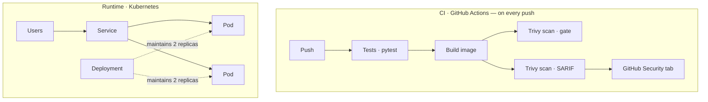

# SecureShip

[](https://github.com/malo-coet/secureship/actions/workflows/ci.yml)

> A containerised API deployed to Kubernetes with a security-first CI/CD pipeline — automated vulnerability scanning, a hardened runtime, and least-privilege access control.

**SecureShip** is a compact FastAPI service used as a vehicle to demonstrate modern **platform-engineering and DevSecOps** practices end to end: from a hardened container image to an automated pipeline that tests, builds, scans, and reports on every push. The application itself is intentionally minimal — the engineering is in everything around it.

## Highlights

- **Hardened container** — multi-stage build, runs as a non-root numeric UID, read-only root filesystem, all Linux capabilities dropped, `seccomp: RuntimeDefault`.
- **Kubernetes** — Deployment (2 replicas, self-healing, liveness/readiness probes), Service, and a dedicated ServiceAccount with the API token disabled (least privilege).
- **Infrastructure as Code** — Terraform provisions an AKS cluster + Azure Container Registry, with ACR pull by managed identity (no stored passwords).
- **CI/CD (GitHub Actions)** — automated tests → image build → Trivy vulnerability scan (**gates** the build on fixable HIGH/CRITICAL) → SARIF results published to the **GitHub Security** tab.
- **DevSecOps judgement** — documented, justified CVE triage (`.trivyignore`) for non-exploitable transitive dependencies, instead of blindly suppressing findings.

## Architecture



The application runs on Kubernetes. Locally it runs on **kind** (Kubernetes-in-Docker); the Terraform in `infra/` provisions a managed **AKS** cluster + **ACR** for cloud deployment.

## Tech stack

| Layer | Tools |
|---|---|
| Application | Python 3.12 · FastAPI |
| Container | Docker (multi-stage, non-root) |
| Orchestration | Kubernetes — kind (local) · AKS (Terraform) |
| Infrastructure as Code | Terraform (`azurerm`) |
| CI/CD | GitHub Actions |
| Security | Trivy · SARIF code scanning · Pod SecurityContext · RBAC |

## Repository structure

```
.
├── app/                        # FastAPI application
├── tests/                      # pytest API tests (run in CI)
├── Dockerfile                  # multi-stage, non-root, numeric UID
├── infra/                      # Terraform: AKS + ACR (azurerm)
├── k8s/
│   ├── deployment.yaml         # cloud deployment (image from ACR)
│   ├── deployment.local.yaml   # local (kind) — hardened SecurityContext
│   ├── service.yaml
│   └── serviceaccount.yaml     # dedicated SA, API token disabled
├── .github/workflows/ci.yml    # test → build → scan → report
├── .trivyignore                # documented, justified CVE exceptions
└── run-local.sh                # one command: cluster + build + deploy
```

## Getting started (local)

**Prerequisites:** Docker Desktop, `kind`, `kubectl`.

```bash
# 1. Create a local cluster, build the image, and deploy
./run-local.sh

# 2. Access the API
kubectl port-forward svc/secureship 8080:80
curl http://localhost:8080/health        # -> {"status":"healthy"}
```

Tear down with `kind delete cluster --name secureship`.

## Cloud deployment (AKS)

```bash
terraform -chdir=infra init
terraform -chdir=infra apply             # provisions AKS + ACR

az aks get-credentials -g <resource-group> -n <cluster>   # from `terraform output`
az acr build -r <acr-name> -t secureship:v1 .
kubectl apply -f k8s/deployment.yaml -f k8s/service.yaml -f k8s/serviceaccount.yaml
```

## Security engineering notes

- **Least privilege everywhere** — the container drops all Linux capabilities and cannot write to its filesystem; the workload runs under a dedicated ServiceAccount with no mounted API token, so a compromised pod holds **no** cluster credentials.
- **Shift-left scanning** — vulnerabilities are caught in CI, before deployment. The gate fails on *fixable* HIGH/CRITICAL findings; the SARIF report keeps full visibility in the Security tab even when the gate fails.
- **Risk-based triage** — when a transitive-dependency CVE cannot be resolved without breaking a parent constraint **and** is not reachable by this application, it is documented and dated in `.trivyignore` rather than silenced — auditable, and revisited on every dependency upgrade.

## Roadmap

- [ ] Continuous deployment (automated rollout)
- [ ] Kubernetes NetworkPolicies (micro-segmentation)
- [ ] Observability — metrics, dashboards, alerting
- [ ] Distroless base image to further shrink the attack surface
